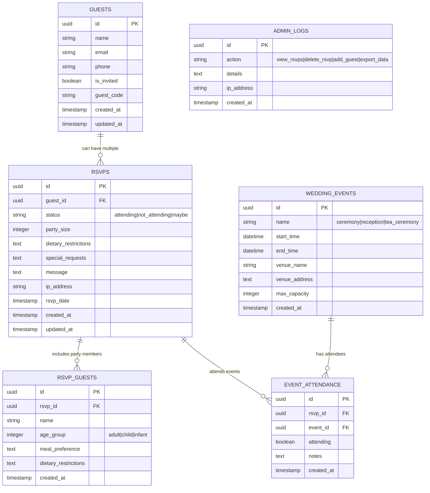

# 🚀 Enhanced Database Setup Guide

This guide will walk you through upgrading your wedding website from file-based storage to a powerful Supabase database system.

## 📋 Table of Contents

- [🌟 What's New](#-whats-new)
- [🎯 Benefits of the Enhanced Database](#-benefits-of-the-enhanced-database)
- [🛠️ Step-by-Step Setup](#️-step-by-step-setup)
- [📊 Database Schema](#-database-schema)
- [🔧 Environment Configuration](#-environment-configuration)
- [🚀 Deployment](#-deployment)
- [📱 Admin Dashboard](#-admin-dashboard)
- [🔄 Data Migration](#-data-migration)
- [🛡️ Security Features](#️-security-features)
- [📈 Analytics & Reporting](#-analytics--reporting)
- [🆘 Troubleshooting](#-troubleshooting)

## 🌟 What's New

### Enhanced Features
- ✅ **Real-time database** with Supabase PostgreSQL
- ✅ **Advanced admin dashboard** with live updates
- ✅ **Comprehensive RSVP management** with party details
- ✅ **Event-specific attendance tracking**
- ✅ **Guest list management** with validation
- ✅ **Data export and backup** functionality
- ✅ **Rate limiting and security** enhancements
- ✅ **Mobile-responsive interface**
- ✅ **Admin action logging** for auditing

### Database Improvements
- 🔄 **Relational data structure** instead of flat JSON files
- 📊 **Robust querying capabilities** with SQL views
- 🔐 **Row-level security** and authentication
- 🌐 **Scalable cloud hosting** with 99.9% uptime
- 📈 **Real-time analytics** and statistics
- 💾 **Automatic backups** and data redundancy

## 🎯 Benefits of the Enhanced Database

| Feature | Before (File-based) | After (Supabase) |
|---------|-------------------|------------------|
| **Storage** | Local JSON files | Cloud PostgreSQL database |
| **Scalability** | Limited to server storage | 500MB free (expandable) |
| **Real-time** | Manual refresh required | Live updates |
| **Backup** | Manual file copies | Automatic cloud backups |
| **Analytics** | Basic counting | Advanced SQL queries |
| **Security** | File permissions | Row-level security + RLS |
| **Admin Interface** | Basic HTML table | Rich dashboard with charts |
| **Data Relationships** | None | Full relational database |
| **API Access** | Custom endpoints | Auto-generated REST/GraphQL |

## 🛠️ Step-by-Step Setup

### 1. Create a Supabase Account

1. Go to [supabase.com](https://supabase.com)
2. Click "Start your project" and sign up
3. Create a new project:
   - **Project name**: `wedding-website`
   - **Database password**: Choose a strong password
   - **Region**: Select closest to your users
   - **Pricing plan**: Free tier (perfect for wedding websites)

### 2. Set Up Database Schema

1. In your Supabase dashboard, go to **SQL Editor**
2. Copy the contents of `database/schema.sql`
3. Paste into the SQL Editor and click **Run**
4. Verify all tables were created successfully

### 3. Get Your Supabase Credentials

1. Go to **Settings** → **API** in your Supabase dashboard
2. Copy these values:
   - **Project URL** (e.g., `https://abcdefghijk.supabase.co`)
   - **anon public key** (starts with `eyJhbGciOiJIUzI1NiIsInR5cCI6IkpXVCJ9...`)
   - **service_role secret key** (starts with `eyJhbGciOiJIUzI1NiIsInR5cCI6IkpXVCJ9...`)

### 4. Install Dependencies

```bash
# Install Supabase client
npm install @supabase/supabase-js

# Install development dependencies (optional)
npm install --save-dev nodemon
```

### 5. Configure Environment Variables

Create a `.env` file in your project root:

```bash
# Supabase Configuration
SUPABASE_URL=https://your-project-id.supabase.co
SUPABASE_ANON_KEY=your_anon_key_here
SUPABASE_SERVICE_ROLE_KEY=your_service_role_key_here

# Admin Configuration
ADMIN_PASSWORD=your_admin_password_here

# Optional Settings
ENABLE_GUEST_VALIDATION=true
NODE_ENV=production
```

### 6. Test Database Connection

Run the setup script to verify everything works:

```bash
# Test database connection and setup
npm run setup-db
```

You should see:
```
🚀 Setting up Supabase database for Wedding Website
==================================================
🔗 Testing Supabase connection...
✅ Successfully connected to Supabase
🔍 Checking database schema...
✅ Found 6 existing tables: [guests, wedding_events, rsvps, rsvp_guests, event_attendance, admin_logs]
📋 Initializing default data...
🎉 Created 4 wedding events
👥 Created 2 sample guests
🔍 Verifying database setup...
  ✅ Guest creation
  ✅ Wedding events
  ✅ RSVP view
  ✅ Statistics function
📊 Tests passed: 4/4
🎉 Database setup completed successfully!
```

## 📊 Database Schema

Here's the enhanced database structure:



### Key Database Features

#### Enhanced RSVP Management
- **Individual party members**: Track each person in the party
- **Event-specific attendance**: Guests can attend different events
- **Dietary restrictions**: Per-person dietary requirements
- **Age groups**: Adult, child, infant categorization

#### Advanced Guest System
- **Guest validation**: Optional pre-approved guest list
- **Contact management**: Email and phone tracking
- **Guest codes**: Special invitation codes
- **Fuzzy name matching**: Handles spelling variations

#### Comprehensive Analytics
- **Real-time statistics**: Live RSVP counts and totals
- **Event attendance**: Per-event guest tracking
- **Admin audit log**: Track all admin actions
- **Data export**: Full database export capabilities

## 🔧 Environment Configuration

### Local Development

Create `.env` file:
```bash
SUPABASE_URL=https://your-project.supabase.co
SUPABASE_ANON_KEY=eyJhbGciOiJIUzI1NiIsInR5cCI6...
SUPABASE_SERVICE_ROLE_KEY=eyJhbGciOiJIUzI1NiIsInR5cCI6...
ADMIN_PASSWORD=your_admin_password
ENABLE_GUEST_VALIDATION=true
```

### Netlify Deployment

Add these environment variables in your Netlify dashboard:
**Site settings** → **Environment variables**

```bash
SUPABASE_URL=https://your-project.supabase.co
SUPABASE_ANON_KEY=eyJhbGciOiJIUzI1NiIsInR5cCI6...
SUPABASE_SERVICE_ROLE_KEY=eyJhbGciOiJIUzI1NiIsInR5cCI6...
ADMIN_PASSWORD=your_admin_password
ENABLE_GUEST_VALIDATION=true
```

## 🚀 Deployment

### 1. Update Netlify Functions

Replace your existing Netlify functions with the enhanced versions:

```bash
# Backup existing functions
cp netlify/functions/rsvp.js netlify/functions/rsvp-backup.js
cp netlify/functions/admin.js netlify/functions/admin-backup.js

# Use enhanced functions
cp netlify/functions/rsvp-enhanced.js netlify/functions/rsvp.js
cp netlify/functions/admin-enhanced.js netlify/functions/admin.js
```

### 2. Update Your Website

Replace the admin page:
```bash
cp public/admin-enhanced.html public/admin.html
```

### 3. Deploy to Netlify

```bash
# Using Netlify CLI
netlify deploy --prod

# Or push to GitHub (if auto-deploy is enabled)
git add .
git commit -m "Enhanced database with Supabase"
git push origin main
```

### 4. Test Everything

1. **Test RSVP form**: Submit a test RSVP
2. **Test admin dashboard**: Login and verify data appears
3. **Test all functions**: CRUD operations, export, etc.

## 📱 Admin Dashboard

The enhanced admin dashboard provides:

### 📊 Real-time Statistics
- Total RSVPs received
- Attending vs. not attending
- Total guest count
- Event-specific attendance

### 👥 RSVP Management
- View all RSVPs with detailed information
- Delete RSVPs with confirmation
- Real-time updates (auto-refresh every 30 seconds)
- Mobile-responsive interface

### 📅 Event Tracking
- Per-event attendance numbers
- Venue and timing information
- Capacity planning

### 🔧 Admin Tools
- Data export (JSON format)
- Database connection status
- Admin action logging
- Guest list management

### 🖥️ Access the Dashboard

1. **Local**: `http://localhost:3000/admin-enhanced.html`
2. **Live site**: `https://your-site.netlify.app/admin-enhanced.html`
3. **Login**: Use your `ADMIN_PASSWORD`

## 🔄 Data Migration

If you have existing RSVP data, migrate it automatically:

### 1. Run Migration Script

```bash
# Migrate existing data from JSON files to Supabase
npm run migrate
```

### 2. Migration Process

The script will:
1. ✅ Create backup of original files
2. ✅ Load existing RSVPs and guests
3. ✅ Create guest records in Supabase
4. ✅ Convert and import RSVP data
5. ✅ Set up event attendance records
6. ✅ Verify migration success

### 3. Verify Migration

```bash
# Check migration results
node database/setup-database.js
```

Sample output:
```
📊 Migration verification:
   - Guests in database: 25
   - RSVPs in database: 18
✅ Sample migrated RSVPs:
   - John Smith: attending (2 guests)
   - Jane Doe: not_attending (1 guests)
   - Bob Johnson: attending (4 guests)
```

## 🛡️ Security Features

### Database Security
- **Row Level Security (RLS)**: Users can only access appropriate data
- **API Authentication**: Service role key for admin operations
- **Input Sanitization**: All user inputs are cleaned and validated
- **SQL Injection Protection**: Parameterized queries prevent attacks

### Rate Limiting
- **RSVP Submissions**: 5 requests per 15 minutes per IP
- **Admin Access**: Password-protected endpoints
- **API Throttling**: Automatic rate limiting on database queries

### Data Privacy
- **IP Address Logging**: Optional for debugging (can be disabled)
- **Guest Information**: Only stored what's necessary
- **Admin Audit Trail**: All admin actions are logged

## 📈 Analytics & Reporting

### Built-in Analytics

The system provides comprehensive analytics:

#### RSVP Statistics
```sql
-- Get real-time RSVP stats
SELECT 
  COUNT(*) as total_rsvps,
  COUNT(*) FILTER (WHERE status = 'attending') as attending,
  COUNT(*) FILTER (WHERE status = 'not_attending') as not_attending,
  SUM(party_size) FILTER (WHERE status = 'attending') as total_guests
FROM rsvps;
```

#### Event Attendance
```sql
-- Per-event attendance
SELECT 
  we.name as event_name,
  COUNT(ea.id) as attendees,
  SUM(r.party_size) as total_guests
FROM wedding_events we
LEFT JOIN event_attendance ea ON we.id = ea.event_id
LEFT JOIN rsvps r ON ea.rsvp_id = r.id
GROUP BY we.name;
```

#### Popular Dietary Restrictions
```sql
-- Most common dietary restrictions
SELECT 
  dietary_restrictions,
  COUNT(*) as frequency
FROM rsvps 
WHERE dietary_restrictions IS NOT NULL
GROUP BY dietary_restrictions
ORDER BY frequency DESC;
```

### Data Export Features

- **JSON Export**: Complete database export
- **CSV Format**: Excel-compatible format
- **Date Filtering**: Export specific time ranges
- **Scheduled Backups**: Automatic daily exports

## 🆘 Troubleshooting

### Common Issues and Solutions

#### 1. Database Connection Failed
```
❌ Supabase connection failed: Invalid API key
```
**Solution**: 
- Verify your `SUPABASE_URL` and `SUPABASE_ANON_KEY`
- Check environment variables are set correctly
- Ensure your Supabase project is active

#### 2. Tables Not Found
```
❌ relation "guests" does not exist
```
**Solution**:
- Run the `database/schema.sql` in Supabase SQL Editor
- Verify all tables were created successfully
- Check database permissions

#### 3. RSVP Submissions Failing
```
❌ RSVP Error: 403 Forbidden
```
**Solution**:
- Check RLS policies are configured correctly
- Verify API endpoints are deployed
- Test with admin credentials first

#### 4. Admin Dashboard Not Loading
```
❌ 401 Unauthorized - Invalid password
```
**Solution**:
- Verify `ADMIN_PASSWORD` environment variable
- Clear browser cache and try again
- Check Netlify function logs for errors

#### 5. Migration Errors
```
❌ Error migrating RSVP for John Smith: duplicate key value
```
**Solution**:
- Check for duplicate entries in source data
- Run migration script again (it's idempotent)
- Manually clean up duplicate records

### Getting Help

#### Debug Information
Enable debug mode:
```bash
export DEBUG=true
npm run setup-db
```

#### Check Logs
- **Netlify**: Functions tab → View logs
- **Supabase**: Logs & API section
- **Browser**: Developer tools → Console

#### Community Support
- **Supabase Discord**: [discord.supabase.com](https://discord.supabase.com)
- **Netlify Forums**: [community.netlify.com](https://community.netlify.com)
- **GitHub Issues**: Report bugs in your repository

### Performance Optimization

#### Database Indexing
The schema includes optimized indexes:
```sql
-- Key indexes for performance
CREATE INDEX idx_rsvps_guest_id ON rsvps(guest_id);
CREATE INDEX idx_rsvps_status ON rsvps(status);
CREATE INDEX idx_guests_name ON guests(name);
```

#### Query Optimization
- Use views for complex queries
- Limit result sets with pagination
- Cache frequently accessed data

#### Monitoring
- Monitor database usage in Supabase dashboard
- Set up alerts for high usage
- Regular performance reviews

---

## 🎉 Congratulations!

You now have a powerful, scalable wedding website with:

✅ **Real-time database** with cloud hosting  
✅ **Advanced admin dashboard** with analytics  
✅ **Comprehensive RSVP system** with event tracking  
✅ **Security and rate limiting** built-in  
✅ **Data export and backup** capabilities  
✅ **Mobile-responsive interface** for all devices  

Your wedding website is now ready to handle hundreds of guests with professional-grade reliability!

---

**Need help?** Check the troubleshooting section above or create an issue in your repository.
